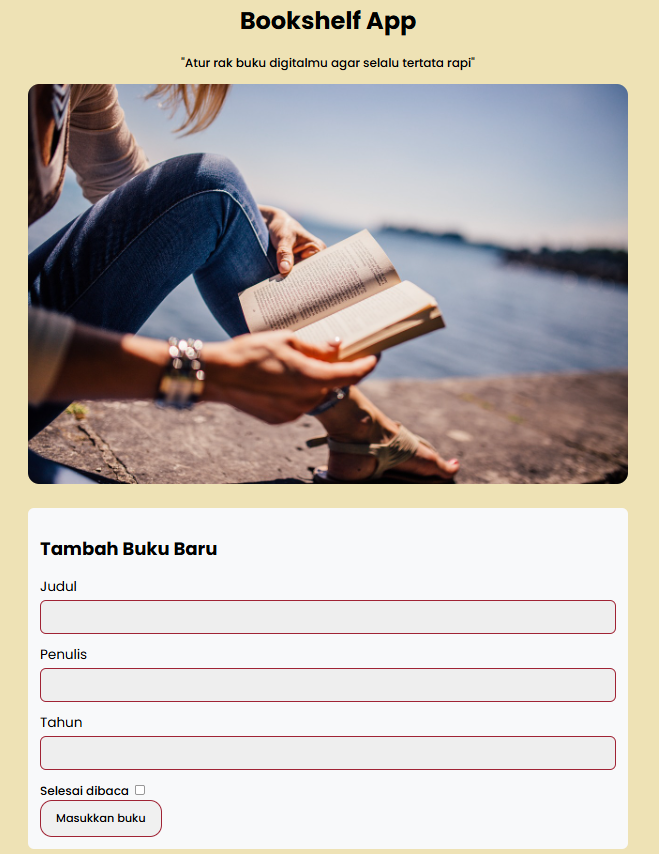

# Bookshelf App - Submission Project Dicoding ID Camp 2024 

Ini adalah project submission untuk aplikasi **Pembukuan** menggunakan **DOM** dan **Web Storage**, dari course **Belajar Membuat Front-End Web Untuk Pemula - Dicoding**. Terima kasih kepada **Indosat Ooredoo Hutchison Digital Camp** dan **Dicoding Indonesia** atas dukungannya dan pengalaman belajar yang berharga.

## Table of Contents

- [Overview](#overview)
  - [Screenshot](#screenshot)
  - [Features](#features)
  - [Links](#links)
- [My Process](#my-process)
  - [Built With](#built-with)
- [Author](#author)
- [Certificate](#certificate)

## Overview

Bookshelf App adalah aplikasi pembukuan sederhana yang memungkinkan pengguna untuk:
- Menambahkan buku baru.
- Memisahkan buku ke dalam dua rak: "Belum selesai dibaca" dan "Selesai dibaca."
- Memindahkan buku antar rak.
- Menghapus buku.
- Menyimpan data buku dengan **localStorage**.
- Mencari buku berdasarkan judul.

## Screenshot

Tampilan dari aplikasi:

## Features

- **Tambah Buku Baru**: Menambahkan buku baru dengan informasi yang diperlukan.
- **Rak Buku**: Memisahkan buku berdasarkan status bacaan.
- **Pindahkan Buku**: Fitur untuk memindahkan buku antar rak.
- **Hapus Buku**: Menghapus buku dari daftar.
- **Penyimpanan**: Data buku disimpan secara lokal dengan **localStorage**.
- **Pencarian**: Mencari buku berdasarkan judul yang diinginkan.

## Links

- **Live Demo**: [Bookshelf App](https://rmdsketch.github.io/Bookshelf-App/)

## My Process

### Built With

- **HTML** - Struktur dasar aplikasi.
- **CSS** - Styling menggunakan CSS dan Flexbox.
- **JavaScript** - Menangani logika aplikasi dan event handling.
- **Custom Events** - Penggunaan custom event untuk interaksi antar komponen.

## Author

- **Instagram** - [@ramadani.sketch](https://www.instagram.com/ramadani_sketch)
- **Facebook** - [@ramadani.sketch](https://www.facebook.com/muhamad.ramadani.733076)
- **LinkedIn** - [@muh.ramadani](https://www.linkedin.com/in/muhamad-ramadani-937976245/)

## Certificate

Lihat sertifikat dari course ini di [Dicoding Certificate](https://www.dicoding.com/certificates/07Z647N3MPQR).
