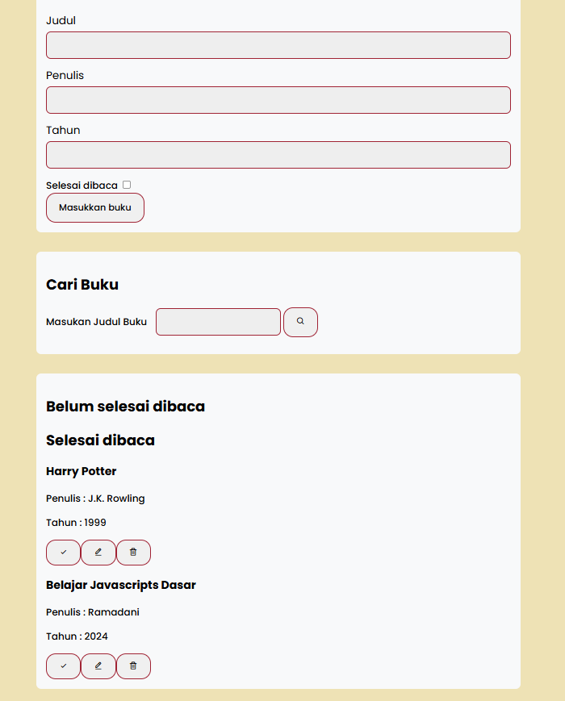

# Bookshelf App - Submission Project Dicoding IDCamp2024

Ini adalah project submission aplikasi Pembukuan menggunakan DOM dan Web Storage, course Belajar Membuat Front-End Web Untuk Pemula - Dicoding. Terima kasih banyak kepada Indosat Ooredoo Hutchison Digital Camp dan Dicoding Indonesia atas dukungannya dan memberikan pengalaman belajar yang sangat berharga.

## Table of Contents

- [Overview](#overview)
  - [Screenshot](#screenshot)
  - [Features](#features)
  - [Links](#links)
- [My process](#my-process)
  - [Built with](#built-with)
- [Author](#author)

## Overview

## Screenshot

### Features

- Mampu Menambahkan Data Buku baru.
- Memiliki minimal Dua Rak Buku. Yakni “Belum selesai dibaca” dan “Selesai dibaca”.
- Dapat Memindahkan Buku antar Rak.
- Dapat Menghapus Data Buku.
- Memanfaatkan localStorage dalam Menyimpan Data Buku.
- Dapat Menggunakan Fitur Pencarian Buku berdasarkan Judul Buku

### Links

- [Live site URL](https://rmdsketch.github.io/Bookshelf-App/)

### My Process

### Built with

- HTML
- CSS
- Flexbox
- JavaScripts
- Custom Event JavaScripts

### Author

- Instagram - [@ramadani.sketch](https://www.instagram.com/ramadani_sketch)
- Facebook - [@ramadani.sketch](https://www.facebook.com/muhamad.ramadani.733076)
- Linkedin - [@muh.ramadani](https://www.linkedin.com/in/muhamad-ramadani-937976245/)

### Certificate

